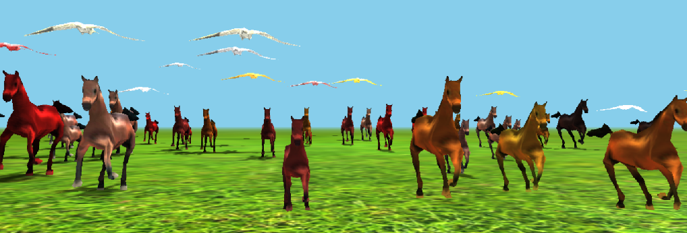

# jsHorse
3D animation on js based on the library of three.js and MD2 models.

## Description

The application is a 3D animation based on the library [three.js](https://github.com/mrdoob/three.js).
It uses [MD2 models of horse and bird](http://telias.free.fr/models_md2_menu.html),
converted to json format by [OutsideOfSociety service](http://oos.moxiecode.com/js_webgl/md2_converter/).

By mouse clicking the horse turns into a bird and back.

By clicking on `F1` or mouse right clicking you can adjust the number of animated objects. By the `Esc` key, you can stop the animation, by `Enter` - start. The `b` button all horses transform into birds, button `h` - on the contrary.

[Run application.]( http://sergechurkin.vacau.com/horse.html)

3D анимация на js на базе библиотеки three.js и MD2 моделей.

## Описание

Приложение представляет собой 3D анимацию на базе библиотеки [three.js](https://github.com/mrdoob/three.js). 
В нем использованы [MD2 модели лошади и птицы](http://telias.free.fr/models_md2_menu.html),
Преобразованный в формат json [сервисом OutsideOfSociety](http://oos.moxiecode.com/js_webgl/md2_converter/). 

По клику мыши лошадь превращается в птицу и обратно. 

По нажатию на `F1` или клику на правую кнопку можно настроить количество анимируемых объектов. По кнопке `Esc` можно остановить анимацию, по `Enter` – запустить. По кнопке `b` все лошали превращаются в птиц, по кнопке `h` - наоборот.

[Запустить приложение.]( http://sergechurkin.vacau.com/horse.html)
